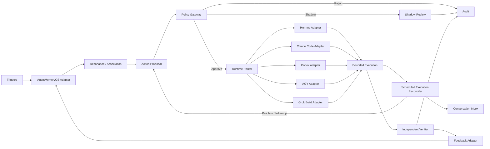

# Bastet-EngramFlow 系統架構

## 1. 架構目標

Bastet-EngramFlow 的核心責任是把 AgentMemoryOS 的記憶／共鳴結果轉為「可治理、可執行、可驗證」的工作，而不是取代 AgentMemoryOS 或任何 Agent Runtime。



## 2. 模組責任

### 2.1 Trigger Gateway

標準化 user request、webhook、cron、lifecycle event 及 resonance event。輸出 `TriggerEnvelope`，並建立 correlation ID、source、scope、timestamp 與 payload digest。

### 2.2 AgentMemoryOS Adapter

- 查詢分級記憶及 resonance 結果。
- 執行 ACL/project boundary filtering。
- 保留 provenance 與版本。
- 將 vendor-specific response 轉成內部 contract。
- 不在 EngramFlow 內複製 AgentMemoryOS 的核心 scoring 邏輯。

### 2.3 Proposal Engine

將 trigger 與 memory evidence 組合為 `ActionProposal`。Proposal 是不可變資料；修訂必須產生新版本與 digest。

### 2.4 Policy Gateway

Policy Gateway 必須在 LLM/tool 執行之前做 deterministic gate：

1. schema validation
2. scope / ACL
3. capability allowlist
4. risk tier
5. idempotency / dedup
6. cooldown / rate / budget
7. environment policy
8. approval

LLM 可提供分類建議，但不可自行繞過 deterministic policy。

### 2.5 Runtime Router 與 Agent Runtime Adapters

- 把 approved proposal 轉為 vendor-neutral bounded execution task。
- 依 capability、health、cost、trust、workspace isolation 與 policy 選擇 runtime。
- 優先使用 native SDK/API，其次正式 MCP/ACP seam，再其次 structured CLI；純文字 CLI 僅能作 Experimental bridge。
- 封裝所有 Hermes、Claude Code、Codex、AGY、Grok Build 等 vendor-specific imports。
- 記錄 adapter/runtime version、task/session/process/run IDs 與實際 capabilities。
- 限制 tools、timeout、工作目錄、sandbox、budget 與批准範圍。
- 不假設不同 runtime 的原生 session 可以互換；跨 Agent handoff 使用版本化 context/artifact bundle。

### 2.6 Verification Engine

Verifier 使用與 worker self-report 不同的證據來源：artifact read-back、exit status、API GET、database SELECT、service health 或 Git remote ref。

### 2.7 Feedback Adapter

以 append-only 方式回寫 verified outcome、人工修正、false trigger、duplicate 與 suppression/reinforcement signal。不得直接覆蓋歷史事件。

### 2.8 Audit Store

保存：

- trigger envelope
- memory evidence references
- proposal/version/digest
- policy decision
- approval record
- execution attempts
- verification evidence
- feedback record

敏感 payload 應加密、redact 或只保存 reference/digest。

### 2.9 Scheduled Execution Reconciler

- 接收隔離 scheduled run 產生的 `ScheduledRunEnvelope`，不 resume 或直接改寫 vendor conversation session store。
- 將 outcome、finding 與 artifact 轉為 `ConversationContextEvent`；對問題形成受治理 `RemediationProposal`。
- SQLite reference store 以同一 transaction 寫入 canonical run ledger、persisted policy decision 與 event/proposal outbox；同 run key 不同 payload 會明確衝突。
- Outbox 使用 lease claim/recovery 與 stable item IDs，提供 at-least-once delivery。Event 必須先 ack，才允許同 run proposal dispatch。
- Sink success 與 durable ack 之間仍存在 replay window；sink 必須以 event/proposal ID idempotent 去重，不能宣稱 exactly-once。
- Canonical run/event/proposal JSON 在寫入前受 byte limit；Hermes 文字 additionally 經 redaction、control-character normalization 與 truncation。
- Hermes integration 只暴露 structured cron result、conversation ingress 與 remediation queue contracts，不 import private Hermes modules，也不直接 mutation transcript/SQLite session history。
- Proposal created、worker reported done、approved、executed 與 independently verified 保持不同狀態。

## 3. 核心資料契約

### TriggerEnvelope

```json
{
  "trigger_id": "trg_...",
  "source": "webhook|cron|user|hermes|memory",
  "scope": {"project": "...", "user": "..."},
  "observed_at": "RFC3339",
  "correlation_id": "cor_...",
  "payload_ref": "...",
  "payload_digest": "sha256:..."
}
```

### PolicyDecision

```json
{
  "decision_id": "dec_...",
  "proposal_id": "prp_...",
  "result": "reject|shadow|await_approval|approve",
  "reason_codes": ["..."],
  "effective_capabilities": ["..."],
  "expires_at": "RFC3339|null",
  "policy_version": "..."
}
```

### ExecutionRun

```json
{
  "run_id": "run_...",
  "proposal_id": "prp_...",
  "runtime": {"id": "codex", "adapter_version": "0.1.0", "runtime_version": "...", "protocol": "sdk"},
  "external": {"task_id": "...", "session_id": "...", "process_id": null},
  "attempt": 1,
  "status": "queued|running|worker_reported_done|failed|timed_out|cancelled",
  "started_at": "RFC3339|null",
  "finished_at": "RFC3339|null"
}
```

`ExecutionRun.status` 只描述 worker execution lifecycle；驗證是獨立 aggregate，不把驗證中間態混入 `ExecutionRun`。整體 workflow projection 可在 worker 回報後呈現 `verifying`，直到對應的 `VerificationResult` 產生 `verified`、`failed` 或 `inconclusive`。這與 `PROJECT_PLAN.md` 的端到端狀態模型相容，但不改寫 worker run 的原始狀態。

### VerificationResult

```json
{
  "verification_id": "ver_...",
  "run_id": "run_...",
  "result": "verified|failed|inconclusive",
  "criteria": [{"name": "...", "passed": true, "evidence_ref": "..."}],
  "verified_at": "RFC3339",
  "verifier_version": "..."
}
```

## 4. Trust boundaries

```text
Untrusted inputs
  ├─ external web/content
  ├─ webhook payload
  ├─ model-generated proposal text
  └─ worker self-report

Trusted controls
  ├─ schema validator
  ├─ deterministic policy
  ├─ secret manager
  ├─ capability-scoped execution identity
  └─ independent verifier/read-back
```

任何 untrusted input 都不能直接產生工具權限、approval 或 verified 狀態。

## 5. Idempotency 與去重

- `idempotency_key` 應由 action type、target、normalized parameters 與 policy scope 決定。
- 同 key 在有效窗口內只允許一個 active execution。
- retry 增加 attempt，不建立第二個邏輯 action。
- 外部系統支援 idempotency key 時必須透傳。
- 外部系統不支援時，執行前後皆需 read-back。

## 6. Approval binding

Approval 必須綁定：

- proposal ID + digest
- allowed capabilities
- target environment/resource
- expiry
- approving identity

Proposal 內容、目標或 capability 改變後，舊 approval 自動失效。

## 7. Upstream compatibility

- 每個 release pin 各 Supported runtime 與 adapter 版本／commit。
- 內部 contract 不直接洩漏任何 runtime 的 database 或 session schema。
- 所有 vendor import 集中在對應 adapter package。
- 支援 release matrix；upstream `main` 只作 early warning。
- 缺少 hook 時先做 external verifier，不立即 fork conversation loop。

## 8. Deployment profiles

### Local development

- mock AgentMemoryOS
- local audit store
- fake runtime 與 vendor-neutral sandbox fixtures
- 無 production credentials

### Shadow

- real memory retrieval
- real trigger
- proposal + policy + audit
- execution disabled

### Controlled execution

- capability-scoped Agent Runtime
- low-risk allowlist
- verifier required
- approval service enabled

## 9. Failure handling

- Memory unavailable：不產生具副作用提案；記錄 degraded event。
- Policy unavailable：fail closed。
- Audit unavailable：medium+ risk fail closed；MVP 建議全部 fail closed。
- Selected runtime unavailable：由 policy 判斷等待、切換至乾淨 workspace 的 fallback runtime，或保持 approved/queued；不得在 dirty workspace 盲目跨 Agent 重試。
- Verifier unavailable：`ExecutionRun` 保持 `worker_reported_done`；workflow projection 顯示 `verifying`，且尚無 final `VerificationResult`，不得標記 verified。
- Feedback unavailable：保存 outbox，避免丟失結果。

## 10. Architecture decision records

後續應建立 `docs/adr/`，至少記錄：

1. Runtime language and package strategy
2. Persistence and event model
3. AgentMemoryOS adapter contract
4. Agent Runtime SPI、routing 與 adapter seam
5. MCP compatibility baseline
6. Risk tiers and approval model
7. Verification evidence model
